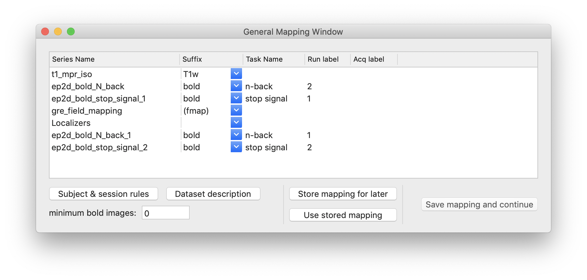

# Data export plugin and automated pipeline based on BIDS - expanding and utilising free software to improve fMRI data flow in Laboratory of Brain Imaging.

## About this page
This is an online version of the poster to be presented at [Neuroinformatics 2019](https://www.neuroinformatics2019.org/). It should contain expanded information from the poster as well as all references in clickable form, so that you won't need to make notes during the poster session.

## Overview


Picture above: MRI data are automatically submitted to a quality control pipeline after each scanning session. They can also be manually exported and organised using a GUI plugin which we created for Horos browser.

## Motivation
Laboratory of Brain Imaging ([LOBI](https://lobi.nencki.gov.pl/)) is a core facility at [Nencki Institute](http://en.nencki.edu.pl/), equipped with 3T MRI scanner available for both internal and external research groups. This means that in a typical month there are around 10 research projects sharing the scanner time. The emergence of Brain Imaging Data Structure, a standard of data organisation, and related free software ecosystem prompted us to explore ways of improving the data flow from scanner to the researchers.

## What is BIDS
BIDS (Brain Imaging Data Structure) is a standard for organisation of neuroimaging data and metadata. It is intended to be both intuitive for users and machine-readable, so that automated tools can be executed with minimal input. A community effort, created initially for MRI, it now encompasses also MEG, EEG and iEEG. You can learn more on [BIDS website](https://bids.neuroimaging.io/).

In short, the files follow a structure like this:
```
sub-Abcdef
├── anat
│   ├── sub-Abcdef_T1w.json
│   └── sub-Abcdef_T1w.nii.gz
├── func
│   ├── sub-Abcdef_task-de_bold.json
│   ├── sub-Abcdef_task-de_bold.nii.gz
│   ├── sub-Abcdef_task-de_events.tsv
```

Together with the standard came **BIDS-Apps** - *container images capturing a neuroimaging pipeline that takes a BIDS formatted dataset as input*. A container can be thought of as a self-sufficient package of software with all its dependencies, which can be run on different operating system (Windows / MacOS / Linux) using Docker or Singularity. You can learn more at the [BIDS-Apps website](https://bids-apps.neuroimaging.io/).

Running an example app with default parameters is as simple as:

```
docker run -ti --rm \        # docker and its options
	-v <bids_dir>:/data:ro   # mount data folder, read-only
	-v <bids_dir>:/out       # mount output folder
	bids/example:0.0.4       # specify the app to be pulled from Docker Hub
	/data /out participant   # input path, output path, analysis level
```

# Horos BIDS Output Plugin
We created a data export extension for [Horos](https://horosproject.org) DICOM browser. According to our knowledge, this is the first GUI-based tool which can be used to automatically create BIDS datasets. The plugin provides a graphical interface where users can annotate sequence names found in selected studies and view the resulting file names before exporting.



The plugin is GPL-licensed and can be obtained from [GitHub](https://github.com/mslw/horos-bids-output).

Relying on user annotations ensures **flexibility** - conversion does not require predefined sequence naming patterns (as long as scans are distincly named). Basic rules for generating or discarding multiple runs of a given task are provided. The **graphical interface** is friendly for non-technical users. **Documentation** with usage instructions is also provided.

The plugin was built for Horos, which is a DICOM browser with good database and network features, distributed under GNU LGPL License. For this reason, we have been using it on a designated computer to query and fetch DICOM files from PACS server, where all scanner data are stored. After fetching required files, users can manage their conversion and organisation using our plugin.

Under the hood, the plugin relies on Horos API for DICOM queries and wraps around [dcm2niix](https://github.com/rordenlab/dcm2niix/) for conversion to NIfTI format. It was written in Objective-C language and Cocoa framework.

# Custom automated pipeline: BIDS-flow
We combined a set of existing tools with lua, python and bash scripting to create an automated pipeline, beginning with raw data coming off the scanner and ending with quality control reports accessible for users. The code is available [on GitHub](https://github.com/nencki-lobi/bids-flow).

We were inspired by the [ReproNim](https://github.com/ReproNim/reproin) project, which aims to provide a similar solution. However, we decided to take a learn-by-doing approach and build a pipeline which is less generic but more suited to our current needs and capabilities. Here we describe our approach and highlight the already existing tools which we found useful.

1. We agreed on a set of sequence names to be used on the scanner: e.g fMRI scans should start with `task-taskname`, anatomical scans should start with `anat` or `T1w`, while scans performed on a phantom should start with `fantom`.
2. The scanner sends the data to a PACS (Picture Archiving and Communication System) server. Here we use [Orthanc](https://www.orthanc-server.com/) to manage the files and database. Since Orthanc supports lua scripting, we use an `OnStableStudy` script (triggered if no new scans from a study arrive for a specified period of time) to copy files to another, computational server (currently a repurposed PC).
3. On the computational server we defined a cron job, which periodically launches the `sentinel.sh` script, which determines the next steps to be taken. During file transfer we simply use `busy` files as flags to mark whether or not processing can proceed. Following steps are contained in separate bash scripts, and selected based on the discovered folder names (which correspond to sequence names).

4. To be continued.

# Future plans

# List of software

Our contribution:
* [Horos BIDS output plugin](https://github.com/mslw/horos-bids-output)
* [Bids-flow](https://github.com/nencki-lobi/bids-flow) - automated data flow from scanner

The following software has been essential for our project:
* [Horos](https://horosproject.org/) - DICOM browser (LGPL)
* [dcm2niix](https://github.com/rordenlab/dcm2niix/) - DICOM to NIfTI converter (BSD, with some units public domain or MIT)
* [Orthanc](https://www.orthanc-server.com/) - DICOM server (GPL)
* [Heudiconv](https://github.com/nipy/heudiconv) - heuristic DICOM converter (Apache)
* [Mriqc](https://mriqc.readthedocs.io/) - BIDS-App with quality control pipeline (BSD 3-Clause)
* [Docker](https://www.docker.com/) - container technology (Apache)

Related software which may be useful for readers:
* [Fmriprep](https://fmriprep.readthedocs.io/en/stable/) - BIDS-App with preprocessing pipeline (BSD 3-Clause)
* [ReproIn](https://github.com/ReproNim/reproin) - automated generation of BIDS datasets from scanner (MIT)
* [XNAT](https://xnat.org/) - imaging informatics platform (own open-source license)
